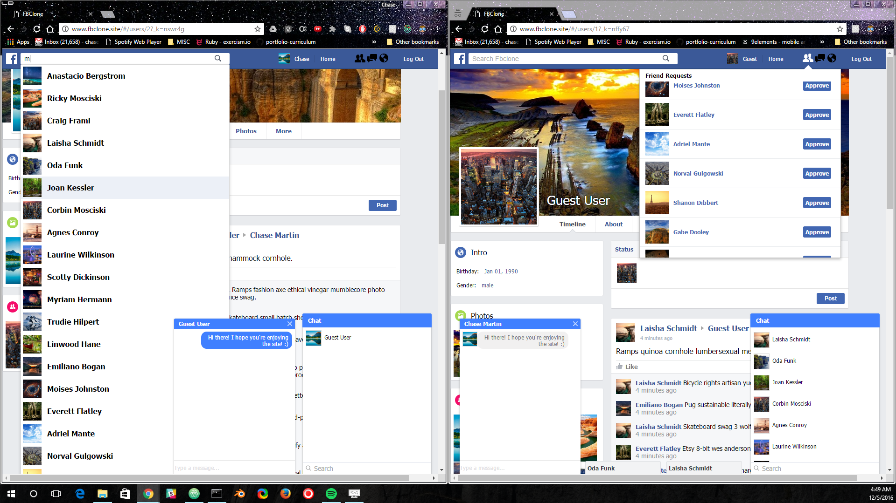
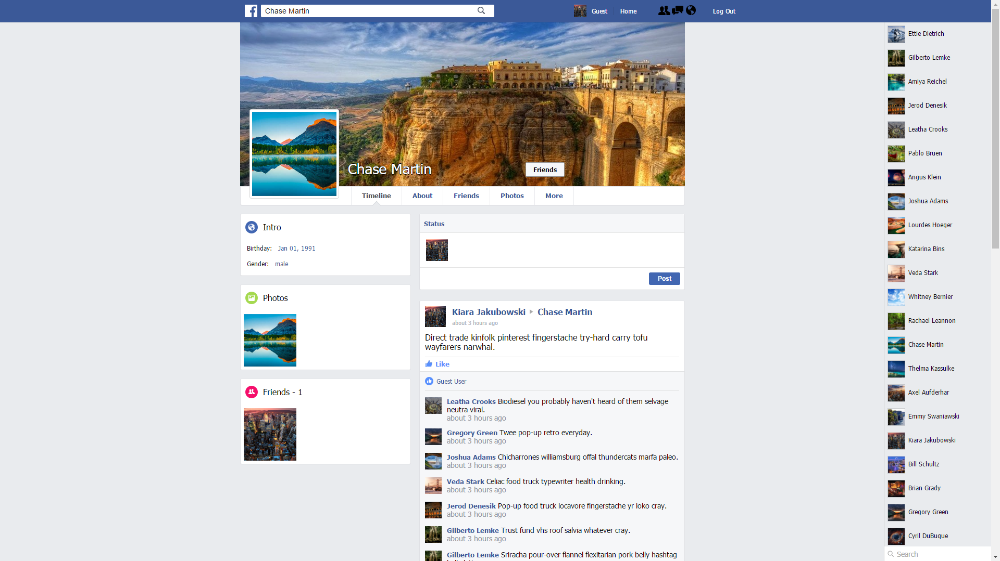
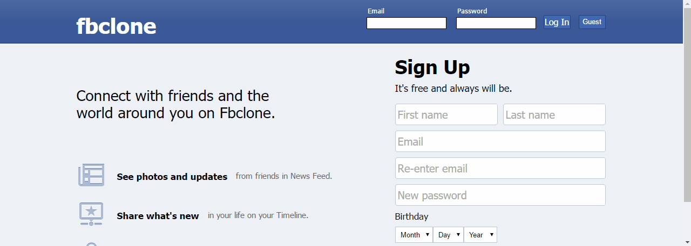
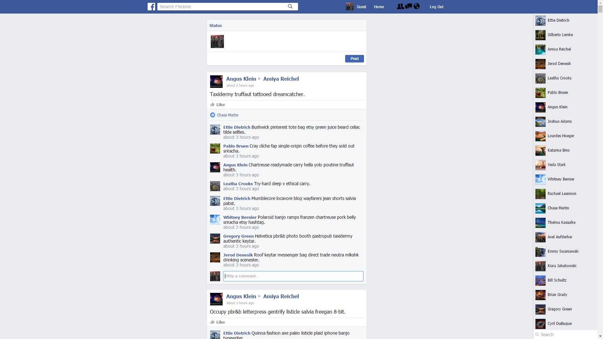
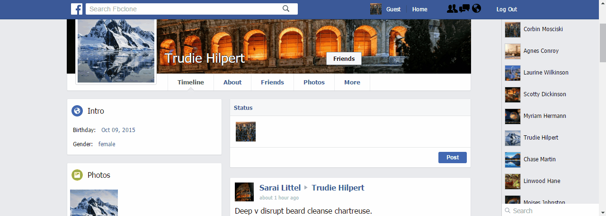

# [Fbclone][fbclone]
[fbclone]: http:fbclone.site


### Description
Fbclone is a social networking platform inspired by Facebook. It implements SPA architecture with a React/Redux frontend and Ajax requests to a JSON API supported by Rails. User authentication is provided with the BCrypt ruby gem to store salted and hashed passwords. ActiveRecord queries are minimized by fetching all user-related data upon login with single query. The live chat feature uses bi-directional functionality via WebSockets with the help of Pusher.

### Features Overview
- [ ] User Authentication
- [ ] Profiles
- [ ] Friending
- [ ] Live Chat
- [ ] Posting
- [ ] Commenting
- [ ] Liking
- [ ] Image Uploading
- [ ] Search



### User Profile Layout
Profile picture, banner image, profile navigation, intro, photos, friends and timeline.



### Guest Login
Allows user to login with guest account to immediately view newsfeed and create comments, posts and likes.


### Account Creation
Provide name, unique email, password(minimum 6 characters), birthday and gender for account credentials and profile info.


### Login
User authentication using BCrypt ruby gem with password salting and digests.



### Newsfeed
Displays all friends' and current user's post. Uses ActiveRecord's ```#include``` method to prefetch all associated post data in one query.
```ruby
class Api::UsersController < ApplicationController
  def show
    @user = User.find(params[:id])
    friend_ids = @user.friends.map { |friend| friend.id }
    friend_ids << @user.id

    @newsfeed_posts = Post
    .includes(
    :author,
    :user,
    { comments: [ { likes: [ :liker ] }, :author ] },
    { likes: [:liker] }
    )
    .where(author_id: friend_ids)
  end
end
```




### Chat Boxes
Expandable and collapsible chat boxes. Open chat box and by clicking on a user in the 'live chat' sidebar.


### Search
Uses a custom 'search' scope defined on the User model to search by first name, last name or email with regular expressions.
```ruby
class User < ActiveRecord::Base
  scope :search, -> (string) {
      select('(first_name || " " || last_name) as \'full_name\', *')
      where(
      'LOWER(email) like LOWER(?)
      OR LOWER(first_name) like LOWER(?)
      OR LOWER(last_name) like LOWER(?)
      OR LOWER(first_name || \' \' || last_name) like LOWER(?)',
      "%#{string}%", "%#{string}%","%#{string}%","%#{string}%") }
end
```


### Accepting Friend Requests
Accept request in 'friend requests' dropdown or directly on user profile and the change will be reflected in both places in real time


### Making Friend Requests
Click 'Add Friend' on a user's profile and they will see your request in their 'friend requests' dropdown.


### Image Uploading
Drag and drop an image file on your own profile picture or background to set a new profile picture or background using ImageMagick for auto-formatting and the Paperclip ruby gem to upload to and store in AWS's S3 service.

```ruby
class Photo < ActiveRecord::Base
  has_attached_file :image, default_url: "seeds/0_:style.jpg", validate_media_type: false,
    styles: { profile_picture: "300x300#", banner:"854x316#"}
  validates_attachment_content_type :image, content_type: /\Aimage\/.*\Z/
  belongs_to :user
end
```


### Bootstrapping Current User
If a user is signed in, ```window.currentUser``` is set to the result of a jbuilder partial which returns all user related data. This prevents screen flickering from Ajax requests after a page reload.
```html+erb
<script id="bootstrap-current-user" type="text/javascript">
  <% if logged_in? %>
  	window.currentUser = <%=
      render(
        "api/users/bootstrap.json.jbuilder",
        locals: {
          user: @user,
          timeline_posts: @timeline_posts,
          newsfeed_posts: @newsfeed_posts
        }
      ).html_safe
    %>
  <% end %>
</script>

<main id="root"></main>
```


### Real-time Feedback
One example of real-time feedback is the instant addition of a user in the live chat sidebar upon accepting their request.




### Upcoming Features
- [ ] Extended live features(see other users' activity in real-time)
- [ ] Infinite scroll
- [ ] Provide link preview if link included in post
- [ ] Notifications
- [ ] Designated search page
- [ ] Comment replies and likes
- [ ] 'About', 'Friends', 'Photos' and 'More' profile sections
- [ ] Posting pictures and videos
- [ ] Privacy settings
